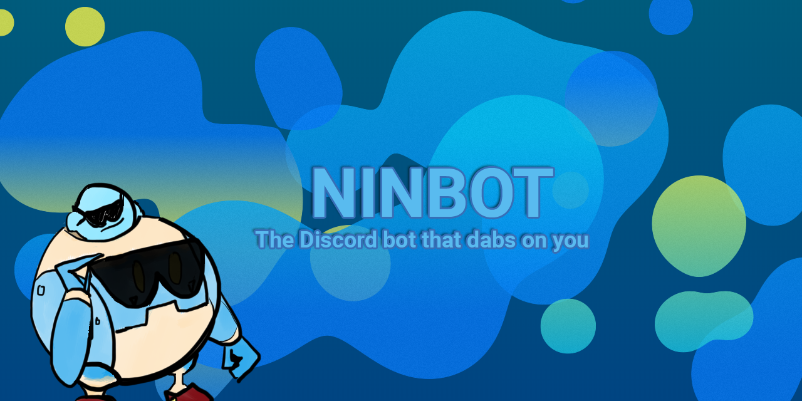

# Ninbot  
Ninbot is a Discord bot with various silly commands and actions, such as dabbing. Ninbot is built for OCW Discord using [JDA.](https://github.com/DV8FromTheWorld/JDA) [Click here](https://discordapp.com/oauth2/authorize?client_id=204484879554052096&scope=bot&permissions=285600848) to add Ninbot to your server!

[Check the documentation for a list of features and help with commands.](http://ninbot.nincodedo.com/)
